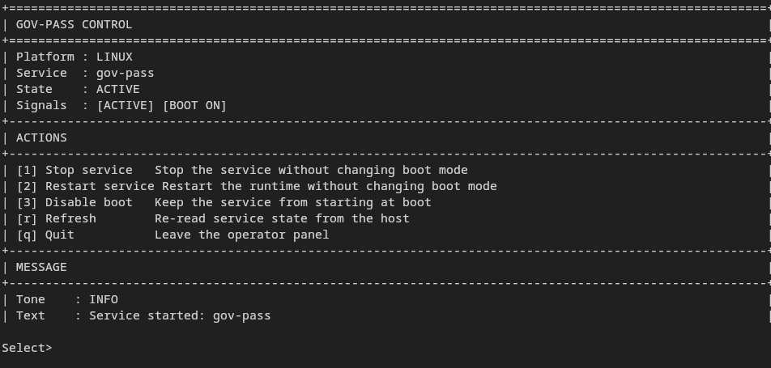

# gov-pass



`gov-pass` is a split-only TLS ClientHello splitter for outbound TCP/443 traffic.
It is not a proxy, VPN, or general DPI bypass tool. The runtime only collects the
first TLS record, splits that payload, then returns the flow to pass-through mode.

## Support

| Platform | Backend | Status |
| --- | --- | --- |
| Windows 10/11 (x64) | WinDivert | Stable |
| Linux (x86_64) | NFQUEUE | Stable |
| FreeBSD / pfSense | pf divert | Experimental |

Linux on supported x86_64 hosts is suitable for day-to-day use. For
multi-egress, VPN, or container environments, pin `--iface` explicitly in the
service defaults before enabling the service.

## Quick Start

All defaults are tuned for immediate use. In normal cases no flags are required.

### Linux

```bash
sudo ./scripts/install_one_touch.sh
```

Service installs keep `--auto-install-tools=false` in `/etc/default/gov-pass`.
On multi-egress, VPN, or container hosts, set `--iface` explicitly there before enabling the service.

Optional TUI controller install:

```bash
sudo INSTALL_TUI=1 ./scripts/install_one_touch.sh
```

Release installer:

```bash
TAG="vX.Y.Z"
PUBKEY="/path/to/release-signing-pub.pem"
BASE_URL="https://github.com/homelabird/gov-pass/releases/download/${TAG}"

curl --proto '=https' --tlsv1.2 -fL "${BASE_URL}/install_one_touch_curl.sh" -o install_one_touch_curl.sh
curl --proto '=https' --tlsv1.2 -fL "${BASE_URL}/SHA256SUMS" -o SHA256SUMS
curl --proto '=https' --tlsv1.2 -fL "${BASE_URL}/SHA256SUMS.sig" -o SHA256SUMS.sig
openssl dgst -sha256 -verify "${PUBKEY}" -signature SHA256SUMS.sig SHA256SUMS
awk '$2 == "install_one_touch_curl.sh" { print $1 "  install_one_touch_curl.sh" }' SHA256SUMS | sha256sum -c -
sudo GOV_PASS_VERSION="${TAG}" \
  GOV_PASS_RELEASE_PUBKEY_PATH="${PUBKEY}" \
  bash ./install_one_touch_curl.sh
```

Verify the installer script against the signed release manifest before running it
with `sudo`. The installer then verifies detached signatures on published
SHA256 manifests before installing any release asset. Obtain the release
signing public key from a maintainer-controlled channel before running it.

### Windows

Run in Administrator PowerShell:

```powershell
.\scripts\install_one_touch.ps1
```

This helper builds `dist\splitter.exe`, packages local WinDivert runtime files,
and installs/starts the WinDivert driver. It does not install the `gov-pass`
Windows service or create `C:\ProgramData\gov-pass\config.json`.

By default, `splitter.exe` refuses to reconfigure an existing `WinDivert`
service when it already points at another valid driver path. Use
`--allow-service-takeover` or `windivert.allow_service_takeover=true` only for
recovery or controlled migrations; cleanup restores the previous service path.

MSI/service layout:

- binaries: `C:\Program Files\gov-pass\`
- service config: `C:\ProgramData\gov-pass\config.json`
- service log: `C:\ProgramData\gov-pass\splitter.log`

Reload config in place:

```powershell
sc.exe control gov-pass paramchange
```

Use [`docs/examples/splitter.windows.json`](docs/examples/splitter.windows.json) as
the service config template and `splitter.exe --print-reloadability` to inspect
restart-required settings on the current build.

### FreeBSD

```bash
sudo ./scripts/install_one_touch.sh
```

Then edit `/usr/local/etc/gov-pass/pf.anchor.conf`, apply it, and enable the
service:

```bash
sudo /usr/local/libexec/gov-pass/install_pf_anchor.sh
sudo sysrc gov_pass_enable=YES
sudo service gov-pass start
```

Use [`docs/pf/`](docs/pf/) for anchor examples and [`docs/DESIGN.md`](docs/DESIGN.md)
for the current FreeBSD caveats. Current scope: reload is restart-only, `pf`
policy remains operator-managed, and the current divert socket path should be
treated as IPv4-only.

## Manual Build

Requirements:

- Go 1.25.8+
- Git

Linux:

```bash
go build -o dist/splitter ./cmd/splitter
sudo ./dist/splitter
```

Windows:

```powershell
go build -o dist\splitter.exe .\cmd\splitter
.\dist\splitter.exe
```

## Runtime Behavior

- Linux installs NFQUEUE rules automatically, disables GRO/GSO/TSO on the
  detected egress interface, and restores offload settings on exit when
  possible. `--ip-family=auto` is the default, so IPv4-only and IPv6-only
  hosts no longer need a dual-stack kernel setup just to start.
- The packaged/systemd Linux service keeps `--auto-install-tools=false`; in
  service mode pre-provision `nftables` or `iptables`/`ip6tables`, `ethtool`,
  and `ip`, and set `--iface` explicitly on multi-egress, container, or VPN
  hosts.
- Windows auto-installs or auto-downloads WinDivert when required.
- FreeBSD remains experimental but now installs an `rc.d` service and `pf`
  helper scripts under `/usr/local/libexec/gov-pass/`; `pf divert-to` policy
  is still operator-managed.
- Stop the runtime with `Ctrl+C` or `SIGTERM`.

## TUI Controller

`gov-pass-tui` is a terminal TUI for service control. It supports
start/stop/restart and boot enable/disable on Linux, Windows, and FreeBSD.


Platform notes:

- Linux, Windows, and FreeBSD now use the shared Bubble Tea operator panel.
- Windows `reload` uses SCM `paramchange`
- Windows `--service-name` accepts normal SCM service names, including names with spaces.
- FreeBSD does not support in-place reload; use restart

Status and boot checks now surface lookup failures as warnings in the panel
instead of silently flattening them into `IDLE` / `BOOT OFF`.

Build:

```bash
make build-tui
```

Install on Linux:

```bash
sudo make install-tui
```

Run against a different service:

```bash
gov-pass-tui --service-name other-service
```

## Configuration

Defaults are intended to work without tuning. When you do need overrides, use
CLI flags or a JSON config file.

Config precedence:

`built-in defaults < config file < explicit CLI flags`

Most useful flags:

- `--config <path>`: load JSON config
- `--check`: run preflight checks and exit
- `--check-json`: preflight checks in JSON
- `--split-mode`: `tls-hello` or `immediate`
- `--split-chunk`: first segment size in bytes
- `--auto-rules` / `--auto-offload` (Linux): disable automatic helpers
- `--ip-family` (Linux): `auto`, `dual`, `ipv4`, or `ipv6`
- `--service` (Windows): run under the Windows service wrapper

Run `splitter --help` for the full flag list on the current platform.

## Docs

- [`SECURITY.md`](SECURITY.md): privilege model and hardening
- [`CONTRIBUTING.md`](CONTRIBUTING.md): local build, test, and CI workflow
- [`docs/DESIGN.md`](docs/DESIGN.md): runtime architecture and platform caveats
- [`docs/MAINTAINERS.md`](docs/MAINTAINERS.md): release, packaging, and signing notes

## Development

```bash
go test ./...
go vet ./...
```

## Security And Notices

- [`SECURITY.md`](SECURITY.md)
- [`docs/THIRD_PARTY_NOTICES.md`](docs/THIRD_PARTY_NOTICES.md)
- [`docs/THIRD_PARTY_SOURCES.md`](docs/THIRD_PARTY_SOURCES.md)
